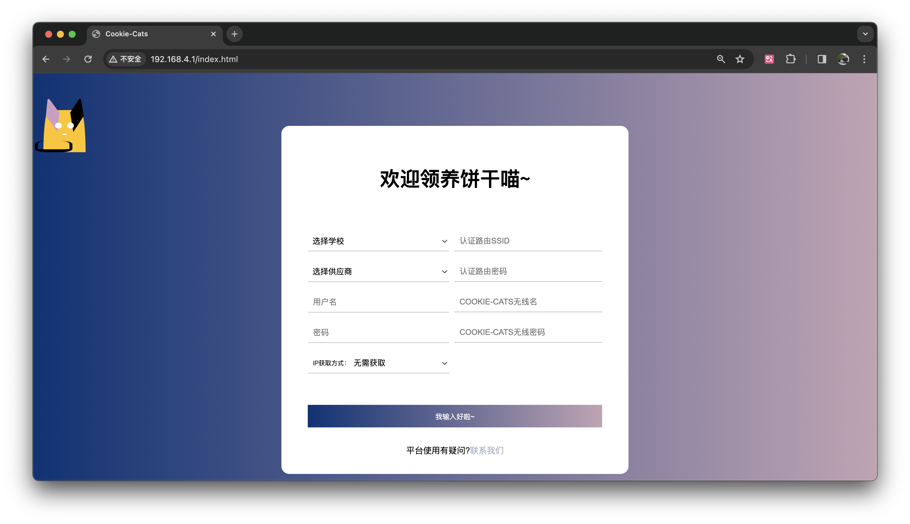
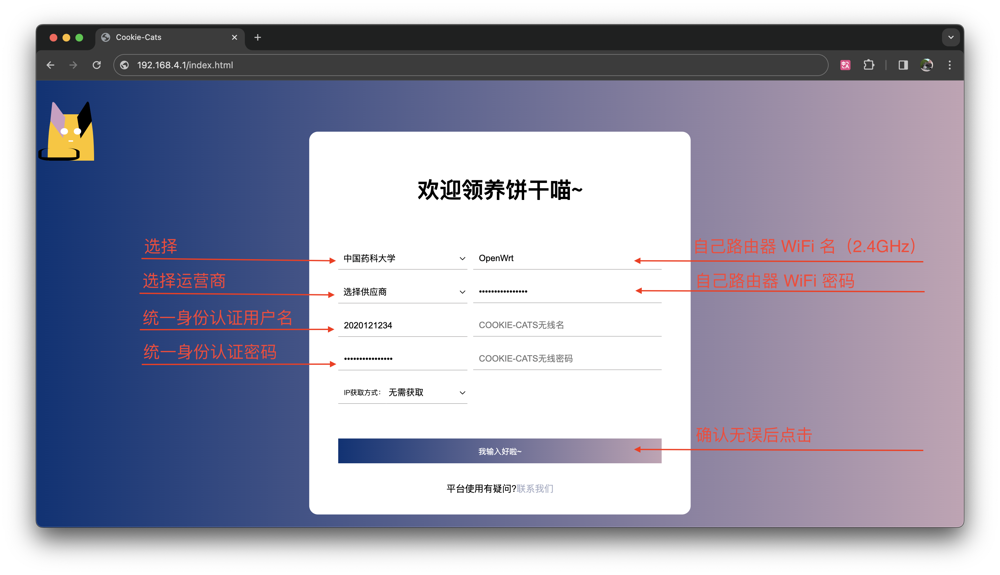
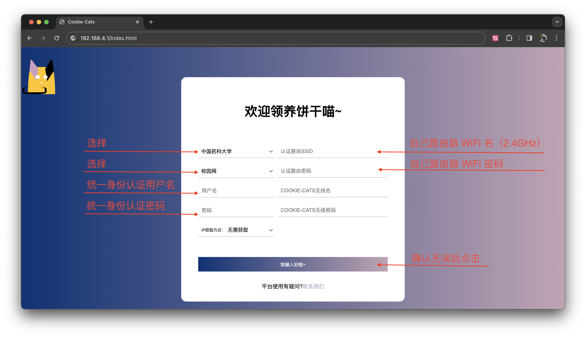
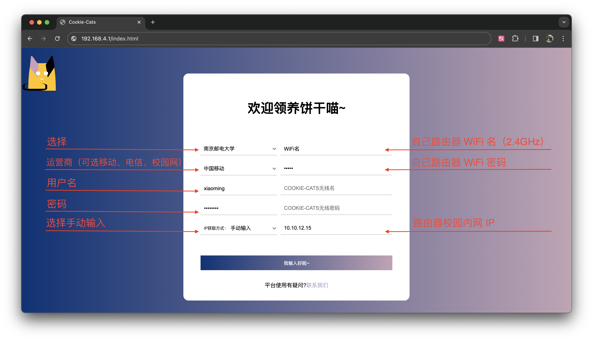
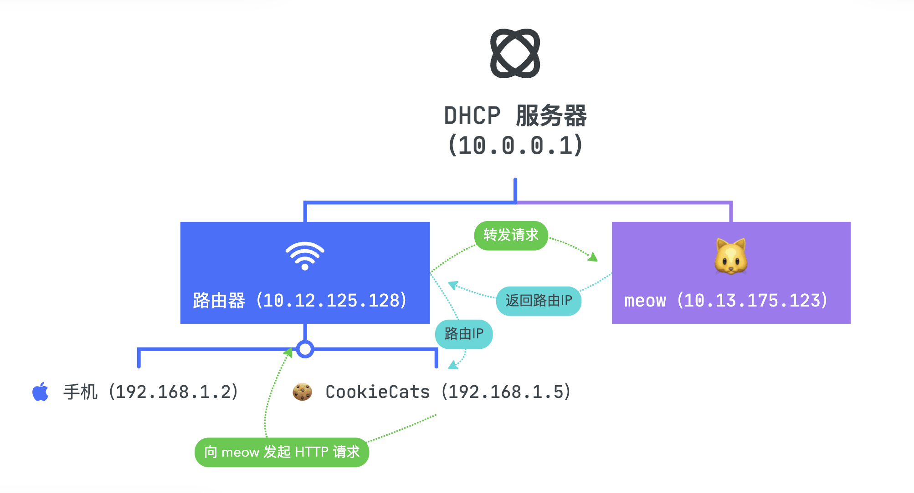

<div>
  
  <br>
  <h1>Cookie-Cats</h1>
  <p>Cookie-Cats（或 CookieCats）是一个基于 ESP8266 开发的简约智能的校园网自动化认证工具。支持所有品牌的路由器，积极为各高校提供校园网认证服务。</p>
</div>

[](https://github.com/Cookie-Cats/Cookie-Cats/actions/workflows/compile.yml)
[](https://app.codacy.com/gh/Cookie-Cats/Cookie-Cats/dashboard?utm_source=gh&utm_medium=referral&utm_content=&utm_campaign=Badge_grade)
[](https://www.gnu.org/licenses/gpl-3.0)

## 功能设计

* **界面简约**，小白也可轻松使用；
* **模块化设计**，易于二次开发：目前已支持认证[多所学校](#认证系统使用指南)。仅需几行代码即可认证其他平台，详见[开发文档](#开发文档)；
* **架构独特，适配所有路由**：**无需**使用昂贵的带有认证功能的路由器，仅需一个便宜好用的 Cookie-Cats，即可免除一切烦恼；
* **自动离线检测**：每 20 秒检测一次连接情况，离线自动重新认证；
* **安全保护**：认证密钥使用 AES128-CBC 算法**加密保存**，无法被读取；**固件签名**技术保护您的 Cookie-Cats 免受恶意固件的攻击；
* **自动更新**：搭配 **Cloudflare Workers 边缘函数**与 **Cloudflare R2 全球分布式存储**分发固件；仅需**重启设备**即可自动更新固件；
* **开源共建**：固件源代码开源，无需担心后门。



## 使用指南

1. 为你的 Cookie-Cats 连接电源；

2. 稍等几秒，直到 LED 连续闪烁 5 次，你可以找到 WiFi 名称为类似： “CookieCat-xxxx” 的 WiFi（xxxx为任意字符）。连接 WiFi，默认密码为`cookiecat`。你可以稍后自定义 WiFi 名与密码（一定要记住密码哦！如果忘记，请在[常见问题](#常见问题)中寻找答案）；

3. 打开浏览器，在地址栏输入 [http://192.168.4.1](http://192.168.4.1)，即可打开配置界面；

4. 在 [认证系统使用指南](#认证系统使用指南) 中找到自己的学校并按要求配置，点击 “我输入好啦～”，设备将自动重启后自动开始认证；

5. **断开 CookieCat-xxxx 的 WiFi，连接自己的 WiFi**，开启快乐网上冲浪！🏄🏄🏄

   **注意：Cookie-Cat 的 WiFi 是无法联网的。如果你遇到了已连接 WiFi 但无法上网的问题，请检查是否错误连接了 Cookie-Cat 的WiFi。建议取消自动连接 Cookie-Cat 的 WiFi。**

## 认证系统使用指南

| 图示 | 含义               |
| ---- | ------------------ |
| ✅    | 已实现             |
| ❌    | 未完成             |
| 🚧    | 正在实现｜修复错误 |
| 🤝    | 需要帮助           |

### 中国药科大学

#### 宿舍网

| 类型 | 状态 |
| ---- | ---- |
| 实现 | ✅    |
| 验证 | ✅    |

设置步骤：

1. 将[路由器设置为 DHCP 客户端模式](https://lic.cpu.edu.cn/ee/c5/c7550a192197/page.htm)；
2. 绑定[运营商宽带与统一身份认证](https://lic.cpu.edu.cn/ee/c6/c7550a192198/page.htm)；
3. 阅读 [使用指南](#使用指南)，打开配置界面（第 2、3 步）；
4. 按图填写配置信息：



5. Cookie-Cats 将自动重启。如果 LED 灯在通电后 50 秒内快速闪烁 5 次，则连接 WiFi 成功；否则请见[常见问题](#常见问题)的第三个问题；
6. 如果 LED 连续闪烁 2 次，则为检测到网络断开、自动连接；如果 LED 闪烁 1 次，则为网络连接正常。Cookie-Cats 每隔 20 秒会自动检测连接状态；
7. 按照 [使用指南](#使用指南) 第 5 步操作。

#### 校园网

| 类型 | 状态                                                     |
| ---- | -------------------------------------------------------- |
| 实现 | ✅                                                        |
| 验证 | ✅                                                        |
| 备注 | 如果 IP 获取方式选择无需获取，将使用 DrCOM API 获取 IP。 |

⚠️ 中国药科大学校园网仅对实验室有线网、CPU 无线客户端等可以获取到 `10.7.x.x` 网段 IP 的设备开放。本选项应用场景包括但不限于为实验室等需要保持网络连接的路由器提供 24 小时联网保障。

设置步骤：

1. 将路由器设置为 DHCP 客户端模式

2. 阅读 [使用指南](#使用指南)，打开配置界面（第 2、3 步）；

3. 按图填写配置信息：

   

   4. 如果 LED 连续闪烁 2 次，则为检测到网络断开、自动连接；如果 LED 闪烁 1 次，则为网络连接正常。Cookie-Cats 每隔 20 秒会自动检测连接状态。

### 南京邮电大学

参考实现：[kaijy91/NJUPT_NET](https://github.com/kaijy91/NJUPT_NET)

| 类型 | 状态                                                         |
| ---- | ------------------------------------------------------------ |
| 实现 | 🚧 \| 🤝                                                       |
| 验证 | ❌ \| 🤝                                                       |
| 备注 | 似乎没有可用的 DrCom API 获取 IP；<br />未经过贵校志愿者测试。 |

设置步骤：

1. 正确配置网络环境
2. 按图填写配置信息：



3. Cookie-Cats 将自动重启。如果 LED 灯在通电后 50 秒内快速闪烁 5 次，则连接 WiFi 成功；否则请见[常见问题](#常见问题)的第三个问题；

4. 如果 LED 连续闪烁 2 次，则为检测到网络断开、自动连接；如果 LED 闪烁 1 次，则为网络连接正常。Cookie-Cats 每隔 20 秒会自动检测连接状态；

5. 按照 [使用指南](#使用指南) 第 5 步操作。

## 常见问题

1. 如何重置 Cookie-Cats 配置？

   * 如果我**可以**连接 Cookie-Cats 的 WiFi

     连接 Cookie-Cats 的 WiFi。在地址栏输入 [http://192.168.4.1/config/rmconfig](http://192.168.4.1/config/rmconfig)，点击回车，Cookie-Cats 将自动重启并清空配置；

   * 如果我**无法**连接 Cookie-Cats 的 WiFi（如忘记了密码）

     连接 Cookie-Cats 设定的路由器 WiFi，打开路由管理界面，在 DHCP 客户端中找到设备名为 Cookie-Cats 的设备。获得其 IP，在浏览器输入 `http://IP地址/config/rmconfig` ，点击回车，Cookie-Cats 将自动重启并清空配置；
     
   * 硬重置，请[阅读](Amnesia/README.md)。


2. 如何判断 Cookie-Cats 已正常连接 WiFi？

   将 Cookie-Cats 断电后重新连接电源。如果 LED 灯在通电后 50 秒内快速闪烁 5 次，则连接 WiFi 成功。

   如果不能连接，请确认：

   * **你输入了正确的 WiFi 名和密码**；
   * 如果你的 WiFi 同时支持 2.4 GHz 和 5GHz，请确保 Cookie-Cats 在尝试连接 2.4 GHz 的 WiFi（如果你的路由器 WiFi 名为 TP_LINK_K7DS 和 TP_LINK_5G_K7DS，请连接 TP_LINK_K7DS）。
   * Cookie-Cats 在 WiFi 信号范围内；
   * 如果你的 WiFi 设置了 MAC 白名单，请将 Cookie-Cats 网卡 MAC 地址加入白名单中；

3. 如果我输入了错误的连接 WiFi 名和密码导致无法连接到路由器怎么办？

​	请稍等约一分钟，**直到 LED 闪烁 5 次**，连接 Cookie-Cats 的 WiFi，在浏览器中打开 [http://192.168.4.1](http://192.168.4.1)，即可重新配置。如果无法打开管理界面，请参考[开发文档](#开发文档)中**如何强制刷机**的问题。

4. 遇到无法解决的错误怎么办？

   * 如果你是电脑小白，请联系售卖此硬件的提供商。

   * 如果你是电脑高手，请打开一个 [Issue](https://github.com/Cookie-Cats/Cookie-Cats/issues) 反馈，帮助我们一起修复错误。


5. 如果我觉得某处可以更好，或发现了错误？

   欢迎投稿！请首先打开一个问题进行讨论，Fork 此存储库并提交拉取请求。您的代码会在 [GNU General Public License v3.0 的改进许可](https://github.com/Cookie-Cats/Cookie-Cats/blob/main/LICENSE) 下发行。

   如果你发现了一个安全问题，请[直接联系我](https://github.com/Metaphorme#contact-me)。

6. 这个项目是开源的，是否意味着我可以自行购买开发版和使用此固件？

​	当然可以，请遵循[许可证](#许可证)。

## 开发文档

1. 如何添加自己学校的认证方式？

2. 如何部署 Cookie-Cats 所需的开发环境？

   * 安装 [Arduino IDE](https://www.arduino.cc/en/software)（1.x 或 2.x 版本皆可）。

   * 安装 [ESP8266 Arduino Core](https://github.com/esp8266/Arduino)

     * 请参考 https://github.com/esp8266/Arduino#installing-with-boards-manager

   * 安装依赖库

     * ArduinoJson，请参考：https://arduinojson.org/v6/doc/installation
     * TickTwo，请参考：https://github.com/sstaub/TickTwo#installation
     * PracticalCrypto
       * 打开 https://github.com/gutierrezps/PracticalCrypto
       * 点击 Code -> Download ZIP
       * 打开 Arduino IDE，在菜单栏中选择 `项目` -> `导入库` -> `添加.ZIP库...` ->选择下载的 ZIP 导入即可。

   * 根据你的硬件 USB 转串口桥接器（如CH340、CP2102）安装驱动程序。

   * 克隆 Cookie-Cats 到本地

     ```bash
     git clone https://github.com/Cookie-Cats/Cookie-Cats.git
     ```

   * 打开 Cookie-Cats/Cookie-Cats/Cookie-Cats.ino

   * 在 IDE 中选择你的开发版和串口

   * 将串口波特率设置为 `115200`

   * 开始开发

3. 如何制作自己的 Cookie-Cats？

   * 购买硬件：本固件理论上在任何存储空间为 4MB 的 ESP8266 开发版上均可运行。

     以下开发版经过测试可用：LOLIN D1 mini、NodeMCU。

4. 认证系统需要提供路由器的 IP 地址，如何获取？

   * 通过认证系统 API 获取

     * Dr.COM

       当使用需要 IP 的认证系统且选择“无需获取”时，将通过 Dr.COM API 获取 IP。实现方法请见 [auth.cpp](Cookie-Cats/auth.cpp)。

   * 使用 meow

     

   * 手动输入

5. 如何强制刷机？

   1. 从 [Amnesia](https://github.com/Cookie-Cats/Cookie-Cats/tree/main/Amnesia) 下载适当 Flash 大小的刷机固件，并按[提示](https://github.com/Cookie-Cats/Cookie-Cats/tree/main/Amnesia/README.md)操作；
   2. 你可以在[这里](https://update.cookiecats.diazepam.cc/)下载最新的 Cookie-Cats 固件，并按照相同的方法上传，即可强制刷机。

6. API 列表

   | 地址                  | 请求类型 | 返回类型         | 状态码｜返回内容                                             | 备注                                                         |
   | --------------------- | -------- | ---------------- | ------------------------------------------------------------ | ------------------------------------------------------------ |
   | /status/network       | GET      | text/plain       | 200｜"true"<br />200 \| "false"                              | 返回网络状态：<br />true 为可联网；false 为不可联网。        |
   | /status/ip            | GET      | text/plain       | 200 \| IP                                                    | 当 config.IP_Obtain_Method 为 meow 时返回 IP；<br />当 config.IP_Obtain_Method 为 manual 时返回手动输入的 IP；<br />当 config.IP_Obtain_Method 为 ununcessary 或未填写时返回 "No IP method to found, please config IP method in config.json"。 |
   | /device/restart       | GET      | text/plain       | 200 \| "Restart now."                                        | Cookie-Cats 将立即重启。                                     |
   | /config/get           | GET      | application/json | 200 \| config<br />500 \| {\"error\":\"No config.json Found.\"} | 返回配置文件内容。                                           |
   | /config/save          | POST     | application/json | 200 \| {"success":"config.json saved."}<br />500 \| {"error":"Failed to save."}<br />500｜{\"error\":\"Invalid JSON format.\"} | 上传并保存配置文件；<br />如果 JSON 格式合法，将把接收到的 JSON 覆盖保存到 config.json。<br />测试命令：curl -X POST -H "Content-Type: application/json" -d '{"Cookie_Cat_SSID":"CookieCat","Cookie_Cat_PASSWORD":"cookiecat","WiFi_SSID":"","WiFi_PASSWORD":"","username":"","password":"","carrier":"","school":"","IP_Obtain_Method":{"meow":"http://192.168.10.151:8080"},"allowOTA":"true"}' http://192.168.4.1/config/save |
   | /config/rmconfig      | GET      | text/plain       | 200 \| "Removed config.json"<br />500 \| "No config.json found." | 清除配置并重启。                                             |
   | /firmware/version     | GET      | text/plain       | 200 \| VERSION                                               | 返回固件版本和作者信息。                                     |
   | /firmware/allowupdate | GET      | text/plain       | 200 \| "true"<br />200 \| "false"                            | 返回是否允许自动更新。                                       |
   | /firmware/update      | GET      | text/plain       | 200 \| "Ok."                                                 | 强制更新，忽略固件和用户设置。<br />返回值不能表示是否更新。 |
   | /auth/status          | GET      | text/plain       | 200 \| "true"<br />200 \| "false"                            | 返回认证程序状态；<br />true 为认证程序启动；false 为认证程序关闭。 |

## 引用与鸣谢

### 本项目引用以下项目的代码：

* [ESP8266 Arduino Core](https://github.com/esp8266/Arduino)，基于 GNU Lesser General Public License v2.1 许可下分发；
* [ArduinoJson](https://arduinojson.org)，基于 MIT License 许可下分发；
* [TickTwo](https://github.com/sstaub/TickTwo)，基于 MIT License 许可下分发；
* [LittleFS](https://github.com/littlefs-project/littlefs)，基于 BSD 3-clause license 许可下分发；
* [PracticalCrypto](https://github.com/gutierrezps/PracticalCrypto)，基于 GNU Lesser General Public License v2.1 许可下分发。

### 本项目的实现参考以下代码或文献：

* [drcoms/drcom-generic](https://github.com/drcoms/drcom-generic)
* [lucienshawls/CPU_Network_Auth](https://github.com/lucienshawls/CPU_Network_Auth)
* [SpacehuhnTech/esp8266_deauther](https://github.com/SpacehuhnTech/esp8266_deauther)
* [SpacehuhnTech/espwebtool](https://github.com/spacehuhntech/espwebtool)
* [kaijy91/NJUPT_NET](https://github.com/kaijy91/NJUPT_NET)

## 许可证

[Cookie-Cats](https://github.com/Cookie-Cats/Cookie-Cats) 在 [GNU General Public License v3.0 的改进许可](https://github.com/Cookie-Cats/Cookie-Cats/blob/main/LICENSE)下发行。

[改进许可](https://github.com/Cookie-Cats/Cookie-Cats/blob/main/LICENSE#L676)指：你可以自由地在 GNU General Public License v3.0 许可下对本项目进行商业使用。每个 - 消费者的总付费（包括月租等方式）必须小于使用场景下运营商宽带最低包月价格。

## 文档版本

适用于 CookieCats PIONEER_0.1_alpha_prerelease_017。

## 固件下载

你可以在 [https://update.cookiecats.diazepam.cc](https://update.cookiecats.diazepam.cc) 下载最新的 Cookie-Cats 固件。
